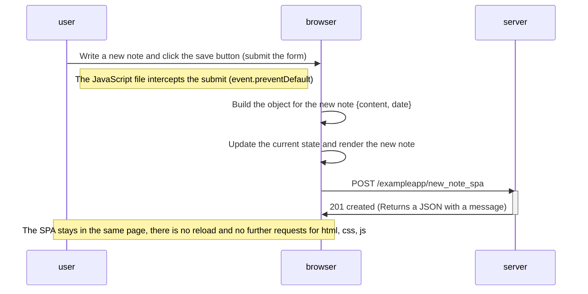

# Diagrama de aplicación de una sola página

```mermaid
sequenceDiagram
    participant user
    participant browser
    participant server

    user->>browser: Write a new note and click the save button (submit the form)
    Note right of user: The JavaScript file intercepts the submit (event.preventDefault)

    browser->>browser: Build the object for the new note {content, date}
    browser->>browser: Update the current state and render the new note

    browser->>server: POST /exampleapp/new_note_spa
    activate server
    server->>browser: 201 created (Returns a JSON with a message)
    deactivate server

    Note over user,browser: The SPA stays in the same page, there is no reload and no further requests for html, css, js
    
```
